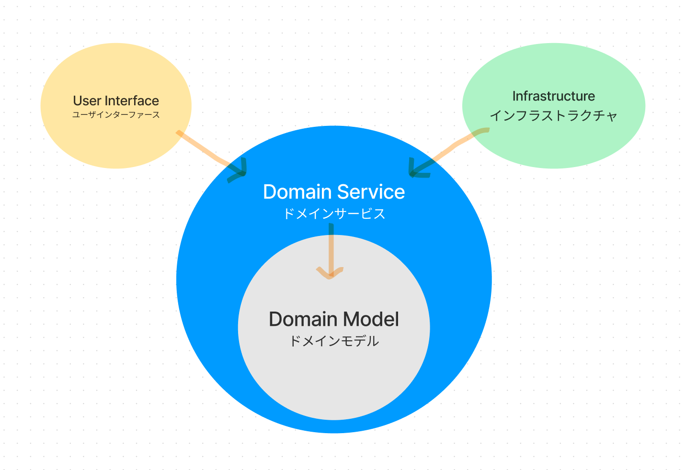

# オニオンアーキテクチャを学ぶ 
[課題内容](https://airtable.com/appPxhCPFYGqqN9YU/tblVlFr2q4lIqDKYc/viwX8r6DpCRp80swL/recCneTjC0Ws8VVh1?blocks=hide)

モデルとは?

現実の世界で対象とする事象が起こる部分

具体例: 荷物管理に関する領域

ドメイン・モデルとは?

ソフトウェアを利用する人たちの「活動」と「関心事」の本質を簡潔に表したモノ。表現

## 課題１
**オニオンアーキテクチャを図解してください**
- ドメインモデル / Domain Model
- ドメインサービス / Domain Service
- インフラ / Infrastructure
- ユーザインターフェース / User Interface

**ドメインモデル層を独立した存在にするメリットとは？**  
- ユーザーインターフェースに些細な変更があってもモデルに影響はしないため。 
- モデルを修正しても、データアクセス処理の変更はしなくても良いため。

**層をまたいで依存関係が発生する時（例えばユースケース層がレポジトリ層のメソッドを呼び出す時など）はインターフェースに対する依存のみ許可します。こうすることに、どのようなメリットがあるのでしょうか？**  
Service が Repository の実体に依存した場合は、Repositoryに大きな修正が発生すると、依存している全てのServiceに影響が出てしまう可能性がある。
なのでアプリケーションの存在意義を決めているのは上位のレイヤなので、下位レイヤの修正が上位レイヤに影響を及ぼしてしまうことは避けなければいけません。
その解決方法として、上位レイヤは下位レイヤの実体に依存するのではなく、上位レイヤで宣言した抽象に依存するようにする

**具体例**  
いいねという機能がある。  
いいねを送ると相手に通知がいき、相手がいいねを返すとマッチングが成立。  
誰が誰にいいねを送ったかを保存しておく必要。  
保存場所をMysqlの `user_like` テーブルに保存。

いいねのアクションで、
UserControllerがUserLikeServiceを呼び出し、UserLikeServiceがUserLikeRepositoryを呼ぶ  
`UserController` → `UserLikeService` →　`UserLikeRepository`

**Good**
`UserController` → `UserServiceInterface` →　`UserLikeService` →　`UserLikeFetcherInterface` → `UserLikeRepository`  

上位レベルの各レイヤでは抽象インターフェースを宣言。
下位レベルのレイヤは抽象インターフェースを実装するようになったため、上位が下位に依存しない。
このインターフェースを満たすモジュールであれば使用できるため、上位レイヤが使いたい下位レイヤのモジュールを選択可能

抽象に依存することで、オブジェクトの再利用、保守、柔軟性のメリットがある

- 特定のユーザにしかリソースの追加や更新を許さないようなアクセス制限機能を実装したいとします。
どの層に記述するのが適切でしょうか？
`Service`層

- データベースをMySQLからPostgreSQL に変更した場合、どの層に変更を加えた方が良いでしょうか？
`Repository`層

## 課題２
- ドメインモデル貧血症　とはどういった現象でしょうか？
- 3層アーキテクチャ とはどんな設計思想なのでしょうか？
- ３層アーキテクチャのデメリットはどういったものでしょうか？ 

