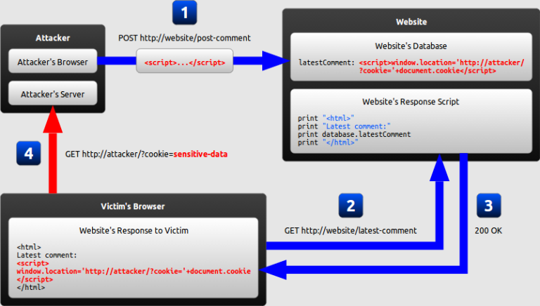

# Webサービスの代表的な脆弱性を理解する 
[課題内容](https://airtable.com/appPxhCPFYGqqN9YU/tblVlFr2q4lIqDKYc/viwX8r6DpCRp80swL/recTGqGmmytK2UJAX?blocks=hide)

## 課題1
- 脆弱性の仕組み、発生し得る被害、対処法を解説してください
  - XSS
    - 攻撃者が悪意のあるクライアント側のコードをWebサイトに注入(injection)することができるセキュリティエクスプロイトのこと
      - 脆弱性の仕組み
        - 信頼されていないソース (多くの場合、リクエスト) を介してウェブアプリにデータが入力されたり、悪意のあるコンテンツが検証されずに動的なコンテンツがユーザーに送信されたりした場合に発生
        - クッキーのセッション情報などの個人情報を攻撃者に送信したり、攻撃者が管理するWebページに被害者をリダイレクトさせたり、脆弱性のあるサイトを装って悪意のある操作を行ったりすることが多い
        
      - 攻撃手法の種類
        - Stored XSS attack
          - injected script は、ターゲットのサーバに永続されます。そして、被害者は、Webブラウザがデータのリクエストを送信すると、この悪意のある script をサーバから取得。
        - Reflected XSS attack 
          - ユーザがだまされて悪意のあるリンクをクリックしたり、細工されたフォームを送信したり、悪意のあるサイトを閲覧したりすると、注入されたコードは脆弱性のあるWebサイトに移動。Webサーバは、注入されたスクリプトを、エラーメッセージ、検索結果、またはリクエストの一部としてサーバに送信されたデータを含むその他のレスポンスなど、ユーザのブラウザに反映。ブラウザは、レスポンスがユーザが既にやり取りしたことのある「信頼できる」サーバからのものであると想定しているため、コードを実行。
        - DOM ベースの XSS attack 
          - payload は、元のクライアントサイドスクリプトが使用していた DOM 環境 を変更した結果、実行。ページ自体は変わりませんが、DOM 環境を悪意を持って改変した結果、ページに含まれるクライアント側のコードが予期せぬ形で実行。 
      - 発生し得る被害
        - ユーザの個人情報の流出
        - 攻撃者が他の個人情報を取得する
      - 対処法
        - データの無力化
        - データの検証
        - フィルターをエスケープする
  - コマンドインジェクション
    - 不正な入力を処理するプログラム内で、実行権限を持つユーザが入力したコマンドを実行する脆弱性のことである。
    - 発生し得る被害
      - 不正な入力を受け取った場合に、不正なコマンドが実行され、ユーザが意図しない操作が行われたり、重要な情報が窃取されたりなどが考えられる。
    - 対処法 
      - 入力値を正規表現による文字列置換により、コマンドを実行しない形式に変換してから実行する。
        - コマンドを実行する前に適切な入力チェックを行うなどの対策をとるのが望ましい。
        - 実行権限を持つユーザには厳重なアクセス管理を行い、不正なアクセスを防止することも重要である。
  - SQLインジェクション
    - Webサイトなどを構成するプログラムからSQL文を発行する際に、不正なSQL文を埋め込む攻撃手法のこと
      - 仕組みとしては、Webサイトなどを構成するプログラムがユーザーが入力した情報を元にSQL文を発行している際に、不正なSQL文を埋め込むことで、攻撃者が意図した動作を行わせる手法です。 
    - 発生し得る被害
      - データ改ざん、情報漏洩、サーバーの不正アクセスなどが挙げられます。 
    - 対処法
      - SQL文の文字列結合を防止することが重要。インジェクションを起こしやすい文字列をエスケープすることなども重要です。また、ログを取り、不正なアクセスがあったら早急に発見し、対処することが重要です。
  - CSRF(Cross-Site Request Forgery)
    - 別のWebサイトから悪意のある攻撃者が、Webアプリケーションの相手先を知らないユーザを操作させて、不正な処理を強制する攻撃行為。
    - 発生し得る被害
      - Webアプリケーションを操作して、悪意のあるユーザが認められない情報を閲覧したり、不正な情報を投稿したり、データを破壊したりする可能性があります。悪意のあるユーザが、他のユーザのアカウントにログインし、情報を変更したり、悪意のあるソフトウェアをインストールしたりする可能性がある
    - 対処法
      - CSRFを防ぐためにトークンを使用して、リクエストを認証することが推奨されています。また、CSRF対策を検証するために、CSRFテストツールを使用することも可能です。また、リクエストを検証するために、referrer情報を使用することも可能

[MDN/Types_of_attacks](https://developer.mozilla.org/ja/docs/Web/Security/Types_of_attacks)