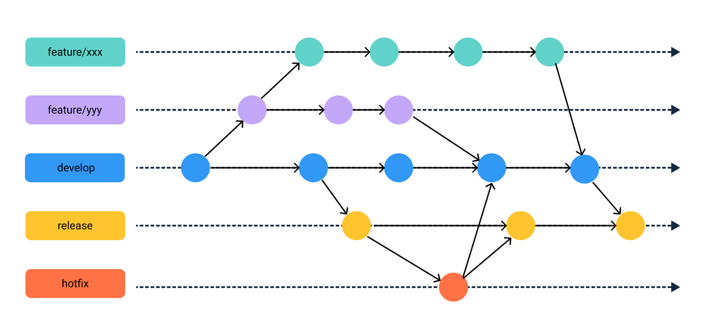

# ブランチ戦略を学ぼう
[課題内容](https://airtable.com/appPxhCPFYGqqN9YU/tblVlFr2q4lIqDKYc/viwX8r6DpCRp80swL/rec2Pxxmfd13tR7K8?blocks=hide)

## 課題１（質問）
- よく知られた代表的なブランチ戦略として以下のパターンが挙げられます。これらを図解してください。また用語が指定されている場合は、必ずその用語を図解に含めて図解してください
  - GitHub Flow
    - GitHub Flow の図解は、以下のようになります。 
    1. 開発者は、すでに存在する master ブランチから新しいブランチを作成します。このブランチは、新しい機能やバグフィックスを行うために使用されます。 
    2. 開発者は、作成したブランチで作業を行います。必要に応じて、複数回コミットを行います。 
    3. 開発者は、作業が完了したら、GitHub 上でプルリクエストを作成します。 
    4. 他の開発者は、プルリクエストをレビューします。レビューに問題がなければ、プルリクエストをマージします。 
    5. マージされたプルリクエストは、master ブランチに反映されます。 
    - GitHub Flow では、新しい機能や変更を行うために新しいブランチを作成し、そこで作業を行います。そして、その作業結果を、プルリクエストを通して共有し、他の開発者がレビューを行うことで、品質の高いコードを作成することができます。
  
  - Gitflow を図解する 
    - develop
    - feature 
    - release 
    - hotfix
    

  - Q. GitflowとGitHub flow、それぞれどのようなメリット/デメリットがありそうでしょうか？
  - A. GitflowとGitHub flowは、Gitリポジトリを管理するためのワークフローの2つです。 
    - Gitflowは、リリースを含む、より構造化されたワークフローを推奨するものです。 
    - Gitflowは、主に大規模なプロジェクトで使用されることが多く、リリースの作成や保守、開発のブランチを切ることを含む、複雑なワークフローをサポートするように設計されています。 
    - GitHub flowは、より軽量で、より簡単なワークフローを推奨するものです。 GitHub flowは、主に小規模なプロジェクトで使用されることが多く、リリースを含むより複雑なワークフローを必要としない場合に適しています。 
    - Gitflowのメリットは、以下のようなものがあります。 
      - リリースを管理するための構造化されたワークフローを提供し、プロジェクトをより効率的に管理できる 
      - 開発のブランチを切ることで、プロジェクトをより安全に管理できる 
      - 大規模なプロジェクトで使用されることが多いため、チーム間でのワークフローの統一が可能である 
    - Gitflowには、以下のようなデメリットもあります。 
      - 複雑なワークフローをサポートするため、小規模なプロジェクトでは必要以上に複雑になる可能性がある 
      - リリースを含むより複雑なワークフローを必要とするため、小規模なプロジェクトでは適していない可能性がある 
      - GitHub flowのメリットは、以下のようなものがあります。 
      - 軽量で、簡単なワークフローを提供し、プロジェクトをより効率的に管理多くの現場で見慣れているのはブランチベースの管理手法
    - トランクベースと呼ばれる管理手法もあります。それぞれどのようなメリット/デメリットがありそうでしょうか？自分が責任者だったらどんな時にどちらを採用しますか？
    - GitflowとGitHub flowは、Gitを使った開発プロセスを管理するためのフローです。どちらもGitのブランチを使用して、主要な開発作業を分割し、安定したリリースを目指します。
    - Gitflowは、主に大規模なプロジェクトで使われるフローです。
      - Gitflowでは、主要な開発作業を「マスター」ブランチと「開発」ブランチに分けます。
      - 「開発」ブランチは常に最新の状態を保ち、「マスター」ブランチはリリースされるごとに更新されます。
      - Gitflowでは、リリース前に「リリース」ブランチを切り、そこで最終的なテストを行います。テストが完了したら、「マスター」ブランチにマージし、新しいリリースを作成します。 
    - GitHub flowは、小規模なプロジェクト向けのフローです。GitHub flowでは、「マスター」ブランチを常にリリース可能な状態とし、開発作業はすべて「マスター」ブランチから派生する「フィーチャー」ブランチで行います。「フィーチャー」ブランチで開発が完了したら、「マスター」ブランチにマージします。GitHub flowでは、リリースは「マスター」ブランチが更新されるたびに行われます。 
      - Gitflowのメリットは、大規模なプロジェクトでの使用が想定されているため、リリース前のテストやステージング環境など、より詳細な開発プロセスをサポートしていることです。
      - 「master」ブランチを常にリリース可能な状態に保つことで、品質を高めることができます。 
    - GitHub flowのメリットは、小規模なプロジェクトでの使用が想定されているため、開発プロセスがスムーズであることです。
  - トランクベース開発について
    - トランクベース開発フローは、大規模なプロジェクトで使用されるフローです。トランクベース開発フローでは、プロジェクトのコードを「master」ブランチで管理し、開発作業はすべて「master」ブランチから派生する「subproject」ブランチで行われます。「subproject」ブランチで開発が完了したら、「master」ブランチにマージします。 
    - トランクベース開発フローのデメリットは、「master」ブランチが常にリリース可能な状態であるため、品質を保証するためのテストが不十分な場合に、リリースされるバグや問題が発生する可能性があることです。また、「subproject」ブランチを切ることで、開発プロセスが複雑になることもデメリットとされます。 
      - トランクベース開発フローでは、リリースのタイミングを意識する必要があるため、リリースのスケジューリングについては、より詳細な計画が必要です。
      - 大規模なプロジェクトでは、「master」ブランチを常にリリース可能な状態に保つことが困難になることもデメリットとされます。 
    - トランクベース開発フローでは、開発プロセスが複雑であるため、チーム内での連携やコミュニケーションが重要になります。
      - トランクベース開発フローでは、開発者が複数の「subproject」ブランチを同時に扱うことがあるため、バージョン管理においても、より複雑であることがあります。