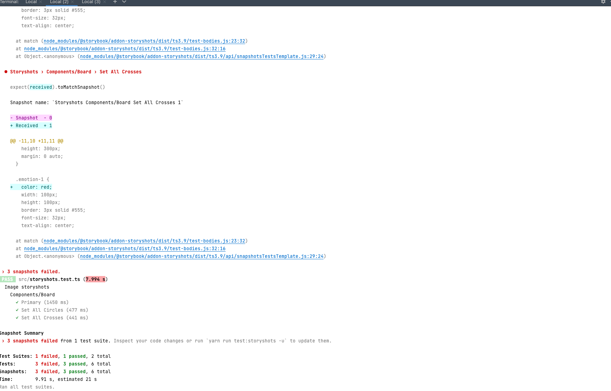
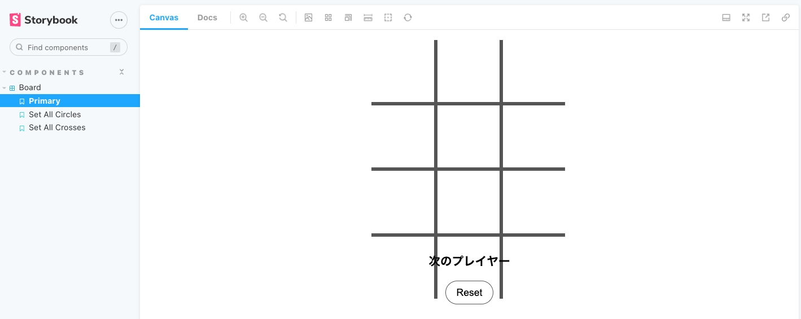
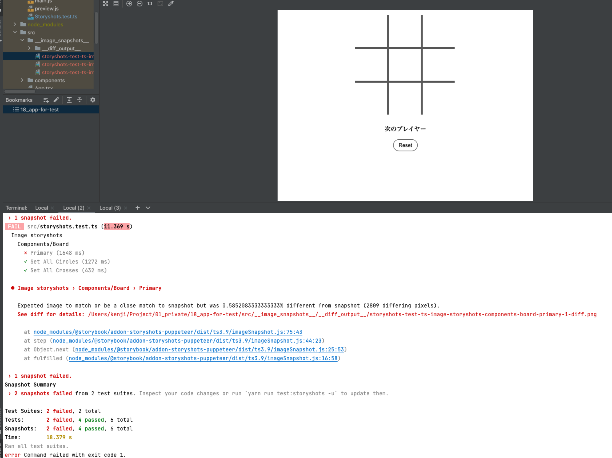

# ビジュアルリグレッションテストを書こう
[課題内容](https://airtable.com/appPxhCPFYGqqN9YU/tblVlFr2q4lIqDKYc/viwX8r6DpCRp80swL/recDIw2Sk16CzaJ9k?blocks=hide)

## 課題１
[実装内容](https://airtable.com/appPxhCPFYGqqN9YU/tblVlFr2q4lIqDKYc/viwX8r6DpCRp80swL/recDIw2Sk16CzaJ9k?blocks=hide)
- Square、markerの`color: red;`に変更し、差分を検出

- 4x3のboardを作成し、差分を検出

- 更新を拒否
 

## 課題２

### ビジュアルリグレッションテストとスナップショットテストの長所と短所

#### ビジュアルリグレッションテストのメリット
- ページ全体の「見た目」をテストすることが可能
- ユニットテストを実施する場合は、コンポーネント毎にテストが必要となり、テストの数が増大します。しかし、ビジュアルレグレッションテストは一つのテストで多くのことをカバーできます。
- 通常のユニットテストではDOMに埋め込まれた文字列を取得し、正解値と比較するテストが実施されることが多いですが、今回はテキスト自体が画像になっているものが多く、このような手法でテストが困難でした。
- 複数人で共通コンポーネントを開発しているため、コードをマージする前に意図していない副作用がないかを確認したかった。
- 技術選定に依存しない

#### ビジュアルリグレッションテストのデメリット
- ビジュアルレグレッションテストはほぼ完璧なテストが可能となる反面、1ピクセル単位の比較となるため、少しのスタイル調整や仕様変更などで簡単にテストが失敗してしまうという特徴があります。テストが失敗すると再度正解となるスナップショットを撮影し、それを正解のスナップショットとして登録するなどの作業が発生します。したがって、メンテナンスコストが高い
- スナップショットの解像度の違いによる差分の発生 / OS 間のシステムフォントの違いによる差分の発生

#### スナップショットテストのメリット
- Storybookの反映漏れを防げる
- 予期せぬ更新を防げる
- インタラクションのUIテストが可能

#### スナップショットテストのデメリット
- HTMLベースの差分を検出で、CSSの差分が含まれず、技術選定による領域が可変する
- バイナリファイルが生成され、大人数の開発ではコンフリクトが生じやすい
- 差分が大量発生する場合はスナップショット差分のレビュー難易度が高く、見落としがちである

**参考文献**
- [ビジュアルリグレッションテストについて](https://engineering.linecorp.com/ja/blog/visual-regression-otoshidama/)
- [ビジュアルリグレッションテストについて](https://tech.dely.jp/entry/vis_reg_test)

## 課題３
- ビジュアルリグレッションテストはどのようなフェーズで導入すべきでしょうか？(開発・保守・運用)
- スナップショットの解像度の違いによる差分の発生 / OS 間のシステムフォントの違いによる差分の発生はどのような対策があるでしょうか？
- ビジュアルリグレッションテストを採用する場合、使用できるテストツールは何があるでしょうか？